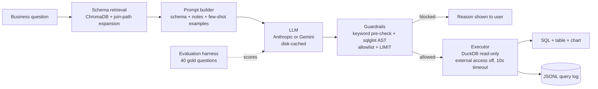

# Commercial Insights Copilot

A natural-language analytics assistant over a synthetic pharma commercial sales warehouse. A user asks a business question in English; a language model writes SQL; safety checks validate it; it runs read-only; the app shows the SQL, a table and a chart. A separate evaluation harness measures how often the generated SQL returns the right answer, comparing three prompting strategies.

## Architecture



## Setup (macOS, Python 3.10 or newer)

```bash
cd commercial-insights-copilot
python3 -m venv .venv && source .venv/bin/activate
pip install -r requirements.txt
cp .env.example .env
```

Edit `.env` and set one key. Never commit it; `.gitignore` already excludes it.

```text
ANTHROPIC_API_KEY=your_key_here
LLM_MODEL=claude-sonnet-5-5
```

For Gemini instead, set `GEMINI_API_KEY` and `LLM_MODEL` (for example `gemini-3.8-flash`). If both keys exist, set `LLM_PROVIDER=anthropic` or `gemini`.

## Run it

```bash
python -m src.data_gen
python -m src.retail_load
pytest
python eval/run_eval.py --limit 6
python eval/run_eval.py
streamlit run app.py
```

1. `python -m src.data_gen` builds `data/sales.duckdb` (about 123k sales rows, 32k calls, 6.6k targets).
2. `pytest` runs the tests. Tests that need `sqlglot` run once it is installed.
3. `eval/run_eval.py --limit 6` is a cheap smoke test. The full run makes up to 120 model calls (40 questions x 3 variants); answers are cached in `.cache/llm`, so reruns cost nothing.
4. `eval/REPORT.md` and `eval/results.csv` are written by the evaluation run.

The first ChromaDB run downloads a small embedding model, so it needs internet. If ChromaDB cannot start, the app prints a notice and falls back to a built-in keyword retriever. Set `RETRIEVER=keyword` to force that.

## Schema-only assistant

Pick **Schema-only assistant** in the sidebar to work with your own database without connecting to it. Nothing is ever run, logged or cached in this mode, and it always uses Gemini (`GEMINI_API_KEY`, optional `GEMINI_MODEL`).

**Schemas.** Add up to 5 named schemas (for example `HR` and `SALES`), each with its own box. Paste `CREATE TABLE` statements or lines such as `orders: order_id, customer_id, total`. The 20,000 character limit applies to all boxes together. Only table and column names are extracted; types, defaults, comments and constraints are dropped. Named schemas are sent as `SCHEMA.table`, so `HR.employees` and `SALES.employees` stay separate; a qualifier already in the DDL is replaced by the box name. Schema names must be unique, ignoring case. A single box may be left unnamed, which sends unqualified table names.

**Write SQL tab.** Choose Oracle, PostgreSQL, MySQL or DuckDB and ask a question. The prompt says "Write SQL for <dialect>". The answer is sanity-checked as text only (one SELECT, no blocked keywords or functions, schema-qualified tables allowed) with sqlglot in that dialect. If sqlglot cannot parse it, the SQL is still shown, with a warning.

**Query optimizer tab.** Paste a query (up to 20,000 characters) and, optionally, EXPLAIN PLAN output (up to 10,000 characters).

- *Check with rules* runs locally with sqlglot and makes no model call. It flags `SELECT *`, functions on columns in `WHERE`, leading-wildcard `LIKE`, joins without a condition, `NOT IN` with a subquery, correlated subqueries (not `EXISTS`), `DISTINCT` with joins, `ORDER BY` in a subquery without `LIMIT`/`FETCH` (Oracle `ROWNUM` top-N is allowed), and visible implicit conversions (a column compared with a quoted number or a date-like string). Each finding has a severity, a reason and a suggested rewrite.
- *Ask Gemini for suggestions* sends the query with string literals replaced by `?` and comments removed, the table and column names from the schema boxes, and the plan text with quoted values replaced by `?`. The output is labelled "Unverified suggestions: compare plans on your own database before using."

## Real data: Online Retail

The sidebar **Dataset** selector switches between the synthetic pharma warehouse and a real dataset. Each dataset has its own DuckDB file, schema docs, few-shot examples, retriever collection and guardrail table allowlist, so a question asked on one can never read the other's tables.

**Source and licence.** UCI Machine Learning Repository, Online Retail dataset, CC BY 4.0. Chen, D. (2015). Online Retail [Dataset]. UCI Machine Learning Repository. https://doi.org/10.24432/C5BW33. These are the real transactions of a UK online gift retailer from 1 December 2010 to 9 December 2011.

```bash
python -m src.retail_load                                   # downloads into data/raw/ if needed, builds data/retail.duckdb
python eval/run_eval.py --dataset retail --variants few_shot_full_schema   # 10 model calls
```

The loader needs `openpyxl` to read the `.xlsx` file and takes about 30 seconds. It prints the row count of the raw file and of each table, plus the number of rows removed or flagged by each cleaning step. The app builds the database itself the first time Online Retail is selected. Neither the raw file nor `data/retail.duckdb` is committed.

- **Schema:** `dim_customer`, `dim_product`, `invoices` and `invoice_lines`, described in `src/schema_docs_retail.yaml`.
- **Cleaning:** each decision and its row count is in `docs/RETAIL_DATA_NOTES.md`. In short: exact duplicates, bad-debt adjustments and lines with a zero or negative price are removed. Cancellations are kept, with `is_cancelled = true` and negative quantities. Lines with no customer are kept, with `customer_id` NULL.
- **Gold set:** `eval/gold_retail.yaml` has 10 questions (4 easy, 4 medium, 2 hard). Every reference answer was checked against an independent pandas computation from the raw file (`tests/retail_reference.py`), and `tests/test_retail.py` repeats that check whenever the raw file is present.
- **Results:** retail evaluation results go to `eval/REPORT_retail.md` and `eval/results_retail.csv`, separate from the pharma report.

**Limits.**
- Ten questions are far too few to estimate accuracy. One wrong answer moves the score by 10 points, so treat a retail run as a smoke test, not a benchmark.
- The data comes from one retailer over one year, mostly UK gift wholesale, with English product names and a handful of countries. Results say nothing about other domains, schemas or databases.
- The gold questions and cleaning rules were written by the same person who built the loader, so they share its assumptions, such as what counts as revenue.
- No retail accuracy figures are included here. Do not quote any you have not measured.

## Data model

Star schema: `dim_product`, `dim_territory`, `dim_hcp`, `dim_date`, `fact_sales`, `fact_calls`, `targets`. All data is synthetic and generated from a fixed seed, with seasonality, launch ramps for newer products, higher volume for top-tier doctors, and monthly targets set so that some territories miss target in some quarters.

## Safety design

- Only one `SELECT` (or `WITH ... SELECT`) statement is accepted.
- A keyword and function pre-check blocks DDL, DML, `COPY`, `ATTACH`, `PRAGMA`, file readers such as `read_csv`, system catalogs and multiple statements.
- A `sqlglot` parse enforces the statement type, a table allowlist (CTE names allowed), no schema-qualified or file-based sources, and adds or caps `LIMIT 1000`.
- DuckDB is opened `read_only=True`, with external access disabled and configuration locked, plus a 10 second timeout.
- Every question, SQL, verdict and latency is appended to `logs/queries.jsonl`.

## Evaluation

`eval/gold.yaml` holds 40 questions with reference SQL: 15 easy (single table), 15 medium (joins) and 10 hard (window functions, CTEs, anti-joins). A generated query is correct when it returns the same rows as the reference query. Column names and row order are ignored, columns may appear in any order, and numbers are compared to 2 decimals. The runner reports execution accuracy, valid-SQL rate, guardrail-block rate and average latency per variant and difficulty, plus a failure-category breakdown.

The three variants:

| Variant | Schema in prompt | Examples |
| --- | --- | --- |
| `zero_shot_full_schema` | all tables | none |
| `few_shot_full_schema` | all tables | 3 worked examples |
| `retrieval_few_shot` | top 3 retrieved tables plus tables needed to join them | 3 worked examples |

**Results:** no measured results are included in this repository yet. Run the evaluation, then copy the numbers from `eval/REPORT.md`. Do not quote figures you have not measured.

## Limitations

- The data is synthetic, so questions are cleaner than real client data would be.
- The gold set has 40 questions, so accuracy differences of a few points are within noise.
- The reference SQL was written by a model and checked by independent pandas calculations on a sample of 12 questions, not all 40. Hand-check more before relying on it.
- Failure categories come from simple rules on the SQL text; they are a first triage.
- There is no per-user access control, and ambiguous questions are not clarified back to the user.
- Top-N questions with tied values can fail on tie-breaking even when the logic is right.
- The guardrails were developed with the pre-check tested directly; the `sqlglot` layer is tested by the tests that run when `sqlglot` is installed.

## Deploying

See `DEPLOY.md`.
